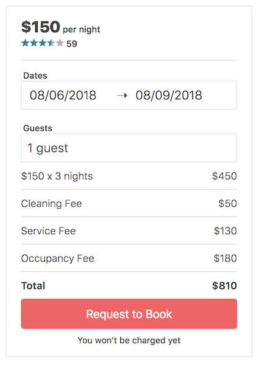

# AirCnB Booking Service

> This module allows users to select a checkin and checkout date from a calendar and displays the total cost associated with the stay.

## Related Projects

  - https://github.com/AirCnB/reviews-module
  - https://github.com/AirCnB/house-description
  - https://github.com/AirCnB/photo-carousel

## Table of Contents

1. [Usage](#Usage)
1. [Requirements](#requirements)
1. [Development](#development)

## Usage

### Docker (recommended)

This module is containerized with Docker. To use with Docker:
- `docker-compose up -d`

The component will be hosted on `localhost:3004`.

### Manually

Otherwise, the module can also be started up manually with webpack and a running MongoDB:

- `npm install -g webpack`
- `npm install`

- `mongod`

- `npm run seed:db`
- `npm start`

And the module will be hosted on `localhost:3004`.

## Development

- `npm run dev:react` to build with webpack.
- `npm serve` to deploy files to AWS S3.

## Requirements

An `nvmrc` file is included if using [nvm](https://github.com/creationix/nvm).

- Node 6.13.0
- Mongo

